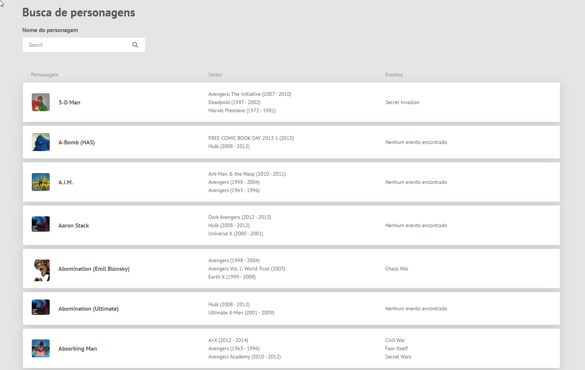

<p align="center">
  
</p>

<p align="center">
  
  
  

     
</p>

<h1 align="center">
    
</h1>

<br>

## 🧪 Tecnologias

Esse projeto foi desenvolvido com as seguintes tecnologias:

- [React](https://reactjs.org)
- [TypeScript](https://www.typescriptlang.org/)

## 🚀 Como executar

Clone o projeto e acesse a pasta do mesmo.

```bash
$ git clone https://github.com/aleilson/code-hero
$ cd code-hero
```

Para iniciá-lo, siga os passos abaixo:
```bash
# Instalar as dependências
$ yarn/ npm install

# Iniciar o projeto
$ yarn/npm start
```
O app estará disponível no seu browser pelo endereço http://localhost:3000.

## 💻 Projeto

Code Hero é um projeto onde buscamos personagens da Marvel.

Este é um projeto desenvolvido para praticar o conhecimento em React JS.


## 📝 License

Esse projeto está sob a licença MIT. Veja o arquivo [LICENSE](LICENSE.md) para mais detalhes.

---

Feito com 💜 by Aleilson